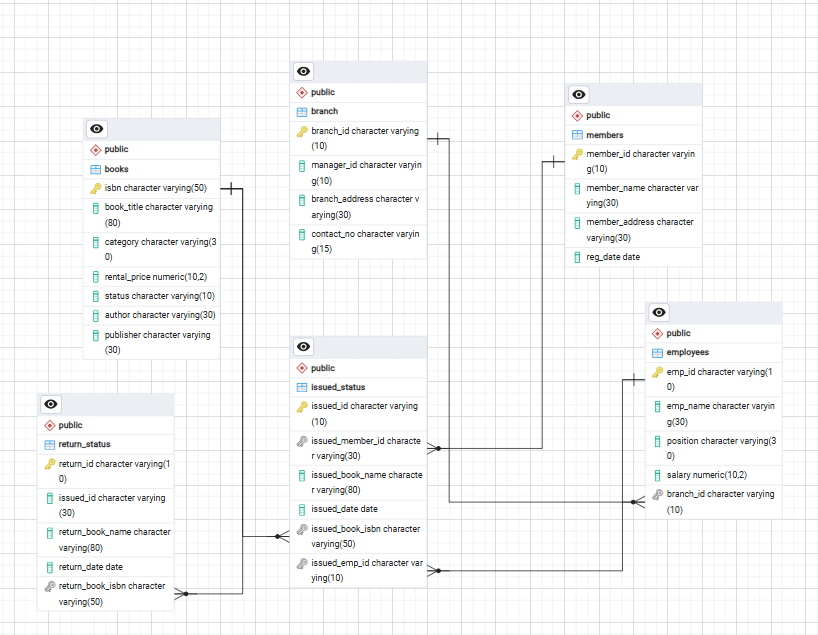
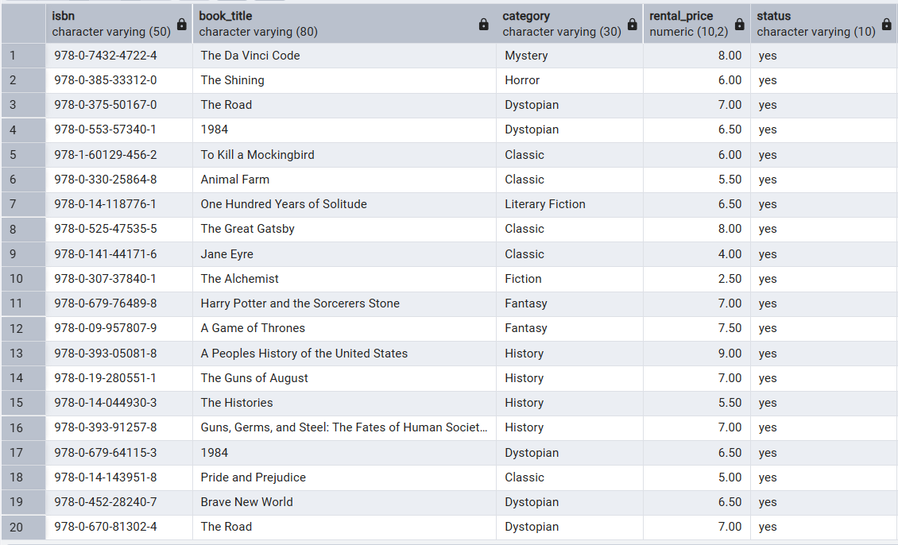
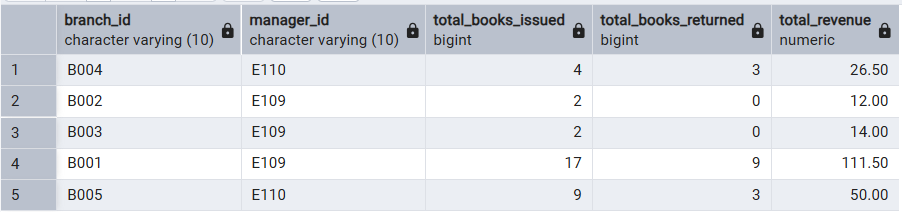
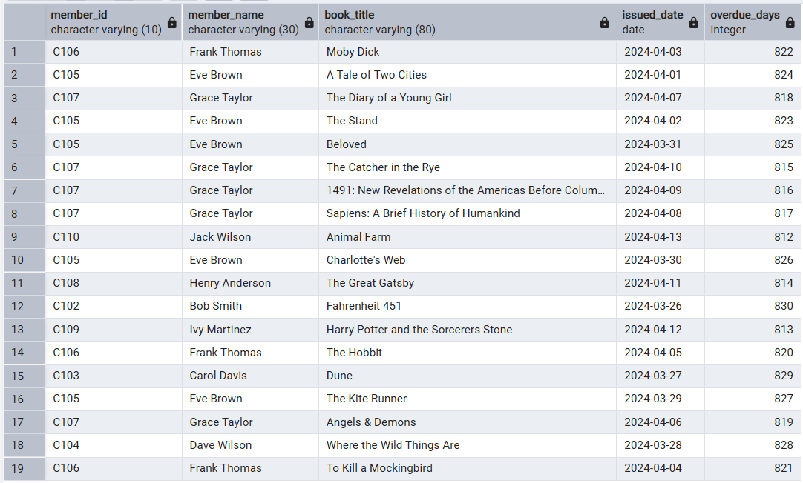
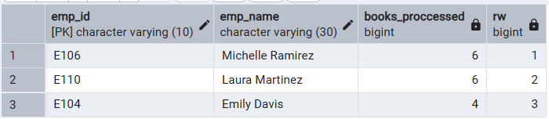

# 📚 Library Management System using PostgreSQL

A complete SQL-based Library Management System built using **PostgreSQL** that demonstrates database design, relational modeling, data analysis, reporting, views, and analytical SQL using window functions.

This project simulates the daily operations of a library and showcases SQL skills commonly required for **Data Analyst**, **Business Analyst**, and **SQL Developer** roles.

---

# 🚀 Features

- Database Design (Normalized Relational Database)
- CRUD Operations
- Joins (INNER, LEFT, SELF)
- Aggregate Functions
- GROUP BY & HAVING
- CTAS (Create Table As Select)
- Views
- Window Functions
- Business Reports
- Analytical Queries

---

# 🛠 Tech Stack

- PostgreSQL
- SQL
- pgAdmin 4

---

# 🗂 Database Schema

The database consists of six relational tables.

| Table | Description |
|--------|-------------|
| Books | Stores all library books |
| Members | Library members |
| Employees | Library employees |
| Branch | Branch information |
| Issued_Status | Book issue transactions |
| Return_Status | Book return transactions |

---

# 📊 Entity Relationship Diagram



---

# 📁 Project Structure

```text
Library-Management-System/
│
├── README.md
├── schema.sql
├── queries.sql
├── views.sql
├── window_functions.sql
│
├── books.csv
├── branch.csv
├── employees.csv
├── members.csv
├── issued_status.csv
├── return_status.csv
│
└── images/
    ├── ER_Diagram.png
    ├── Database.png
    ├── available_books.png
    ├── Branch_performance.png
    ├── Overdue_books.png
    └── window_functions.png
```

---

# 🏗 Database Objects

## Tables

- Books
- Members
- Employees
- Branch
- Issued_Status
- Return_Status

## Views

- available_books
- active_members
- overdue_books
- employee_performance
- branch_performance

---

# 📸 Database Objects


---

# 📌 SQL Concepts Covered

### Database Design

- CREATE DATABASE
- CREATE TABLE
- PRIMARY KEY
- FOREIGN KEY

### CRUD Operations

- INSERT
- UPDATE
- DELETE
- SELECT

### SQL Queries

- WHERE
- ORDER BY
- GROUP BY
- HAVING
- DISTINCT

### Joins

- INNER JOIN
- LEFT JOIN
- SELF JOIN

### Aggregate Functions

- COUNT()
- SUM()
- AVG()
- MIN()
- MAX()

### Advanced SQL

- CASE
- Subqueries
- CTAS
- Views
- Date Functions

### Window Functions

- ROW_NUMBER()
- RANK()
- DENSE_RANK()

---

# 📈 Business Problems Solved

✔ Add new books

✔ Update member details

✔ Delete issue records

✔ Retrieve books issued by an employee

✔ Find members who borrowed multiple books

✔ Calculate rental revenue

✔ Identify recently registered members

✔ Find overdue books

✔ Update book availability after return

✔ Generate branch performance reports

✔ Create active members report

✔ Rank books using window functions

✔ Rank employees based on books processed

---

# 📊 Sample Reports

## Available Books View



---

## Branch Performance Report



---

## Overdue Books Report



---

## Window Functions



---


# 🎓 Skills Demonstrated

- SQL Programming
- Relational Database Design
- Data Cleaning
- Data Analysis
- Business Reporting
- Analytical SQL
- PostgreSQL
- Window Functions
- Query Optimization
- Views
- CTAS

---

# ▶️ How to Run

1. Clone this repository

```bash
git clone https://github.com/yourusername/Library-Management-System.git
```

2. Open PostgreSQL / pgAdmin

3. Execute

```
schema.sql
```

4. Import CSV files into their respective tables.

5. Execute

```
queries.sql
```

6. Execute

```
views.sql
```

7. Execute

```
window_functions.sql
```

---

# 📌 Future Improvements

- Stored Procedures
- Functions
- Triggers
- Indexing
- CTEs
- Recursive CTEs
- Transactions

---

# 👩‍💻 Author

**Vasanthi Jonnakuti**

B.Tech Computer Science Engineering

Aspiring Data Analyst | SQL | Python | Power BI

---

## ⭐ If you found this project useful, please consider giving it a Star.
